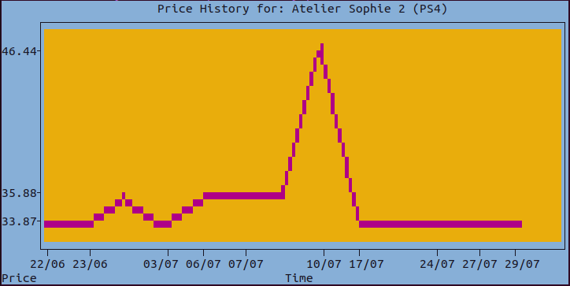
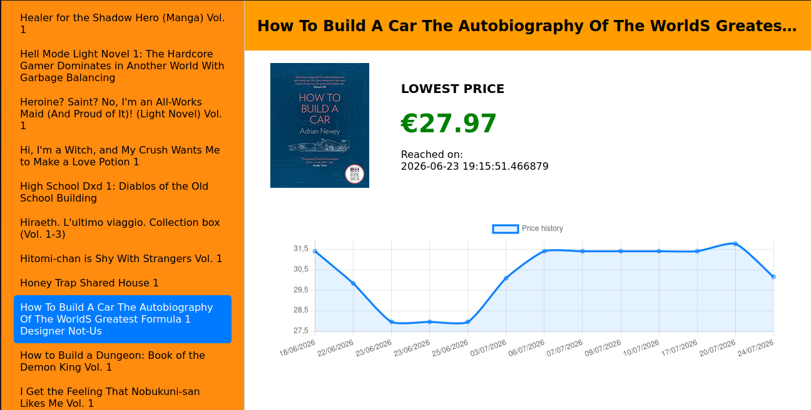

# Amazon-Price-Tracker
A script-based Amazon price tracker, written in Python, using sqlite3 and equipped with a NodeJS-powered dashboard.

This script was made to automatically manage the process of checking prices for products sold on Amazon. Instead of keeping multiple tabs open just to check whether something you want to buy has hit a lower price, you can simply use this script to locally automate this process.

# Features
This script comes bundled with various features, such as:
- A local database storing many relevant details for each product
- The possibility of providing a file with multiple Amazon links to be inserted in the database, instead of having to execute the script individually for each one of them
- A series of commands to actively manage your local database
- Automatically updates the lowest ever seen price whenever you execute the script, telling you precisely when such value was seen
- A local price chart for every product in the database
- The ability to print such a price chart directly in the terminal (and the ability to tinker with how the plots look)...

- ...or of looking at more information using the bundled dashboard! 

# Requirements
Simply install the dependencies contained in `requirements.txt` by using pip: 
```
pip install -r requirements.txt
```
If you also want to use the dashboard, you will also have to install the necessary NodeJS dependencies. To do this, execute the following from the root folder:
```
cd dashboard
npm install
```
# Usage
```
python3 amazon_price_tracker.py [-l | -p[v] | -d[p] | -fi | -web | -plt | <link> | -h] [ <file.txt> | <string>]
```
where:
```
-l = take the links from <file.txt> and executes the script for each one of them
-p = print all the items in the database together with their lowest ever seen price and the date in which this happened
-pv = same as -p, but it omits those items that have a dummy price (=999)
-d = returns all the items that have <string> in their name and gives the user the ability to delete any one of them
-dp = deletes the entire price history stored in the database
-fi = fetches the link to the image showed in the Amazon page associated to each object in the database and saves it (legacy, you should have no reason to use it, apart from possible broken links)
-web = launches the dashboard in your default browser. NOTE: when you are done, remember to click Ctrl + C to shut down the local server
-plt = fetches all items that have <string> in their name and gives the user the ability to select for which to print the price history plot in the terminal
-h = prints how you can use the script
<link> = an Amazon link - the less tracking clutter, the better (which includes basically anything after the ? following the product id in the link)
<file.txt> = a .txt file containing, for each line, an Amazon link pointing to the item you want the price of
<string> = a string of text
```
Here are some example usages:
```
python3 amazon_price_tracker.py -l amazon_links.txt #takes the links in amazon_links.txt and adds them to the db
python3 amazon_price_tracker.py #updates the prices for the items in the db
python3 amazon_price_tracker.py -plt monster #lets you select any item in the db containing "monster" in its title and print its price history in the terminal
python3 amazon_price_tracker.py <link> #adds <link> to the db
```
If executed with no arguments, the script updates the price of the items stored in the local database.

Moreover, if you want to customize the plots printed in the terminal, you can do so by modifying lines 24-27 of the script, while setting the value at line 21 (`customized_plots`) to `True`. Below, we provide the specific variables you need to tinker with in order to change how the plots look. Please refer to [Plotext's documentation](https://github.com/piccolomo/plotext/blob/master/readme/aspect.md#colors) for how you can customize your plots.

```
customized_plot = True #if enabled, it allows you to customize the plotting in the terminal with the colours of your choice
#refer to https://github.com/piccolomo/plotext/blob/master/readme/aspect.md#colors for customization
DEFAULT_THEME = "elegant"
ticks_color = "black" 
canvas_color = "orange+"
axis_color = 110 
marker_color = 126
```

# Deleting the database
If you want to delete the entire database, simply delete the .db file contained in the /data folder (which the script will automatically create whenever it is first launched).

# Scheduling the script - LINUX ONLY
If you do not want to manually launch the script every day, you can automate such process by scheduling its execution using cron. In order to do this, first verify if cron is already installed on your device by executing the following:
```
crontab -h
```
If cron is installed, it should return an usage error. Otherwise, you can install cron as follows:
```
sudo apt install cron
```
Then, in order to schedule the script, type the following command:
```
crontab -e
```
It will now ask you what editor you want to use. I suggest selecting nano, due to it providing a file with the instructions on how to set up a cron job. Otherwise, you can select whatever editor you have set up on your computer.

Then, you will need to schedule the execution of the script. In order to do this, you can copy the following, assuming you want the script to be executed every day at 18:00 
```
0 18 * * * /usr/bin/python3 "path/to/script.py"
```
If you also want to get the output of the file, you can append or redirect it to a file as follows:
```
0 18 * * * /usr/bin/python3 "path/to/script.py" >> path/to/file #append
0 18 * * * /usr/bin/python3 "path/to/script.py" > path/to/file #redirect
```
If you instead want to modify the scheduling to suit it to your needs, please refer to the instructions provided by cron in the file. If you want, instead, to modify the behaviour of the script, please refer to the Usage section. After this, save the file and exit the editor. Now the cron job will be set up to run at the next possible occurrence, based on the provided time.

Note that /usr/bin/python3 depends on where your local installation of Python is located. It may be enough to call python3/python, depending on your version, but providing the path is guaranteed to make the script be correctly executed.

If you want to remove this scheduling, you can proceed as above and delete the content of the file, or you can do the following:
```
crontab -r
```

Many thanks to the [following conversation](https://askubuntu.com/questions/1200232/task-scheduler-in-ubuntu) for helping with this section.

# List of TODOs
- At the moment, the script only takes the price Amazon shows on the page, instead of the entire price list. This can lead to situations where no price is found, even though there is a vendor selling the item.
- Following the above, the script makes no difference between used and new prices. This is something that may be worked upon in the future
- At this point in time, the script does not work on Windows (and maybe Mac, though I have not tested this), due to the use of termcolor, which is unavailable for Windows. Hence, such a version of the script may be provided in the future.
- If a Windows-based version of the script will be created, then we will also need to figure out how to successfully schedule the script, as cron is unavailable there.
- Modify the script to include a minimal print version to use for scheduling
- Ulterior features may be included, if they are useful to the objectives of this project
